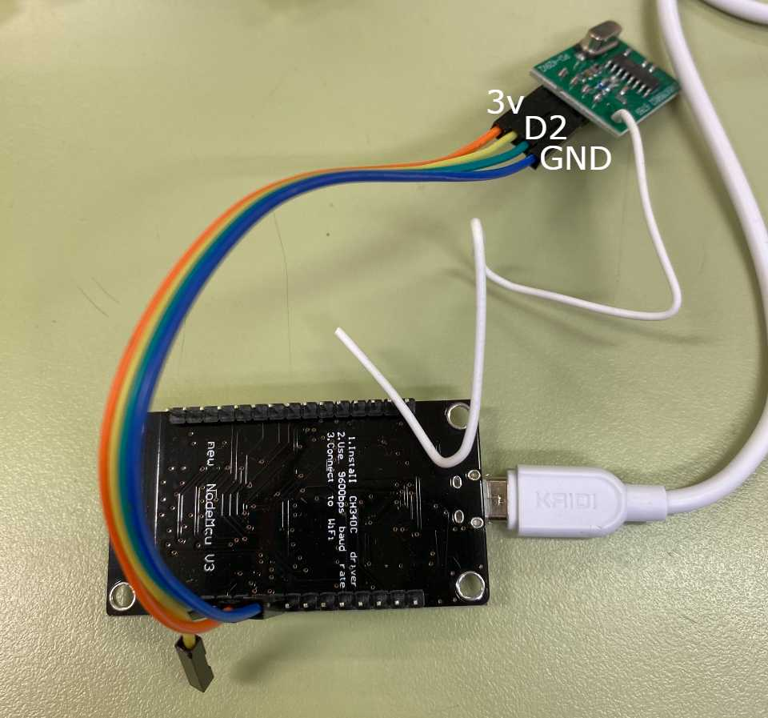
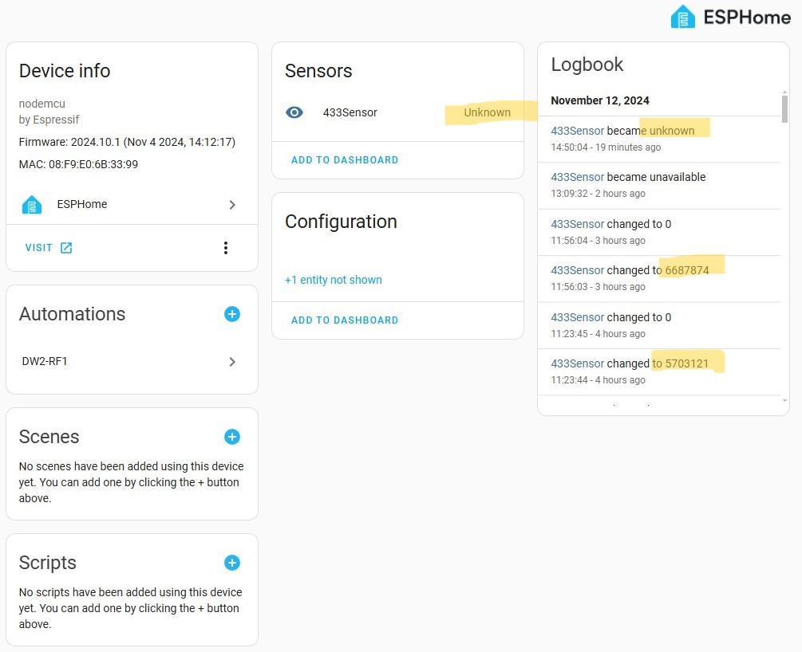

# wirelessdoor

Primeiro passo é adquirir os equipamentos necessários:
1) Modulo Receptor MRF-01
2) Sonoff DW2-RF
3) ESP Lolin ou Wemos
4) 1 resistor 1k + 1 resistor 10k e 1 Transistor Bc547b

Preparação do ESP
1) Conectorizar os fios jumpers no MRF-01 até o ESP

2) No Home Assistant adicione um novo dispositivo ESPHOME
3) Abra o arquivo esp-rf-bridge.yaml e use como modelo
4) Grave o firmware no ESP
ATENÇÃO: se usar porta diferente da D2, mude lá no arquivo 433Sensor/RcSwitchSensor.h
5) Vá nos Devices do ESPHOME e abra o esp-rf-bridge

6) Note os IDs do DW2-RF que vão aparecer ai, apenas mostra ao abrir

Preparação do Sonoff RF Door
1) Observe o diagrama a seguir

2) É necessário fazer a soldagem

