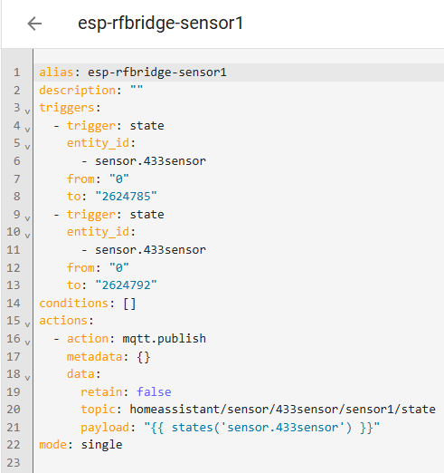

# wirelessdoor

#Primeiro passo é adquirir os equipamentos necessários:
1) Modulo Receptor MRF-01
2) Sonoff DW2-RF
3) ESP Lolin ou Wemos
4) 1 resistor 1k + 1 resistor 10k e 1 Transistor Bc547b

#Preparação do ESP
1) Conectorizar os fios jumpers no MRF-01 até o ESP

2) No Home Assistant adicione um novo dispositivo ESPHOME
3) Abra o arquivo esp-rf-bridge.yaml e use como modelo
4) Grave o firmware no ESP
ATENÇÃO: se usar porta diferente da D2, mude lá no arquivo 433Sensor/RcSwitchSensor.h
5) Vá nos Devices do ESPHOME e abra o esp-rf-bridge

6) Note os IDs do DW2-RF que vão aparecer, mostra apenas ao abrir

#Preparação do Sonoff RF Door
1) Observe o diagrama a seguir

2) É necessário fazer a soldagem

3) Note os IDs do DW2-RF que vão aparecer, agora mostra ao abrir/fechar

#Criação do sensor
1) Abra o arquivo configuration.yaml
2) Inclua uma nova linha: binary_sensor: !include binary_sensor.yaml
3) Crie um novo arquivo com o nome binary_sensor.yaml

#Criação do lovelace
1) Novo Card: Entity

#Criação do lovelace Mushroom
1) Novo Card: Mushroom Template

2) Abra o arquivo mushroom.txt e use como modelo

## UPGRADE ##

Existe um problema usando binary_sensor, ele perde o valor assim que o Home Assistant é reiniciado
Troque por um sensor mqtt(faça instalação previa no home assistant)

#Criação do sensor
1) Abra o arquivo configuration.yaml
2) Inclua uma nova linha:

mqtt:
  binary_sensor: !include mqtt/binary_sensor.yaml

3) Crie um novo arquivo na pasta chamada mqtt com o nome binary_sensor.yaml

#Criação das automações
1) Abra Settings / Automations
2) + Create Automation
3) Create New Automation
4) Clique nos tres pontos do canto direito / Edit in YAML
5) Basta fazer conforme os dois sensores abaixo

